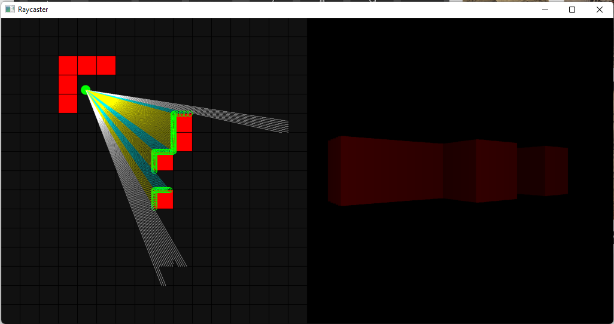

# Raycaster

### Overview

This program is a demonstration of the use of a raycaster to render a 3D scene from a 2D grid. This technique was popular for old games as it uses an efficient algorithm and not a lot of data needs to be stored. Raycasters work by firing out multiple *rays* from a camera. If a ray collides with a wall, a rectangle is drawn with the height of this rectangle depending on how far the ray travelled. If a ray does not collide with a wall, i.e. the ray exceeds its maximum distance, no rectangle is drawn. Repeating this for a multitude of different angles, the raycaster is able to draw what the player would see were they in a 3D world.

### References

For the raycasting algorithm, I used javidx9's implementation in the video [Super Fast Ray Casting in Tiled Worlds using DDA](https://www.youtube.com/watch?v=NbSee-XM7WA). The inspiration for designing the renderer came from 3D Sage's video series: [Make Your Own Raycaster](https://www.youtube.com/watch?v=gYRrGTC7GtA).

### Controls
| Command |        Action        |
|:-------:|:--------------------:|
|    W    |    Move Forwards     |
|    S    |    Move Backwards    |
|    D    |   Rotate Clockwise   |
|    S    | Rotate Anticlockwise |
